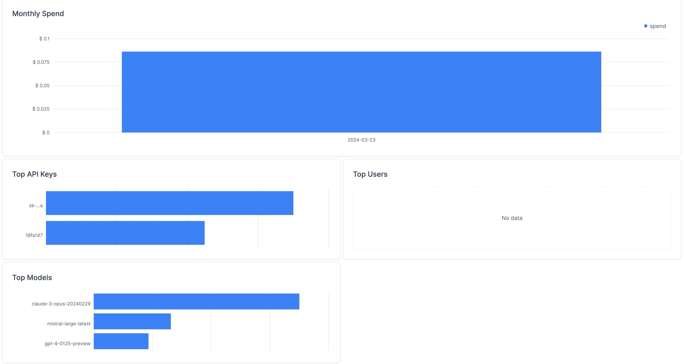

1. [Getting Started](#getting-started)
2. [Prerequisites](#prerequisites)
3. [Python Version](#python-version)
4. [Environment Setup](#environment-setup)
    1. [Using pyenv](#using-pyenv)
    2. [Using conda](#using-conda)
    3. [Install project dependencies](#install-project-dependencies)
5. [Configuration](#configuration)
    1. [Define the LLMs config](#1-define-the-llms-config)
    2. [Configure the proxy server UI](#2-configure-the-proxy-server-ui)
6. [Useful tools](#useful-tools)
    1. [Lint code](#1-lint-code)
    2. [Review code from file using gpt4](#2-review-code-from-file-using-gpt4)
    3. [Start the LiteLLM proxy server](#3-start-the-litellm-proxy-server)
    4. ~~[Start Autogen Studio GUI (terminal usage recommended instead of ui)](#4-start-autogen-studio-gui-terminal-usage-recommended-instead-of-ui)~~ (temporarily deprecated)
    5. [Monitor costs and view usage](#5-monitor-costs-and-view-usage)
7. [Running the Applications](#running-the-applications)
    1. [Start conversation](#1-start-conversation)
    2. [Ask Chef](#2-ask-ai-chef)
9. [Setup local and third party LLMs](#setup-local-and-third-party-llms)

This project is a small wrapper over [AutoGen](https://github.com/microsoft/autogen). It integrates the [LiteLLM](https://github.com/BerriAI/litellm) proxy server to give you easy access to any LLM (proprietary or open source), without having to leave the comfort of your terminal.

It uses the [Rich](https://github.com/Textualize/rich) and [prompt_toolkit](https://github.com/prompt-toolkit/python-prompt-toolkit) libraries to colorize inputs/ outputs which makes reading large responses in a plain terminal a bit more digestible:

Input:

Output


## Getting Started

This section provides instructions on how to set up your development environment for working on this project.

## Prerequisites

Before you begin, ensure you have either `pyenv` or `conda` installed on your system to manage Python versions and environments.

## Python Version

This project is tested with Python `3.11.8`. It is recommended to use this specific version to avoid any compatibility issues.

## Environment Setup

### Using [uv](https://github.com/astral-sh/uv) (*recommended*)

```sh
uv python install 3.11.8
uv venv --python 3.11.8
source .venv/bin/activate
```

### Using [pyenv](https://github.com/pyenv/pyenv)

If you are using `pyenv`, you can install Python `3.11.8` and set it as the local version for the project using the following commands:

```sh
pyenv install 3.11.8
pyenv local 3.11.8
pyenv virtualenv myenv
```

### Using conda

If you prefer `conda`, create a new environment with Python `3.11.8` using the following command:

```sh
conda create --name myenv python=3.11.8
conda activate myenv
```

Replace `myenv` with a name of your choice for the environment.

### Install project dependencies

Once you have the correct version of Python set up, install the project dependencies.
Only add `uv` prefix if you are using this tool.

```sh
uv pip install -e .
```

If you also plan to setup and use the the litellm proxy dashboard UI, which offers neat costs monitoring and usage statistics, install `autogen-experiments[proxy]` extra dependencies via:
```sh
uv pip install -e '.[proxy]'
```

Depending on your use cases, you might need other extra dependencies like `autogen-experiments[text-compression]` | `autogen-experiments[rag]` which you can install individually or just install everything via
```sh
pip install -e '.[all]'
```

## Configuration

### 1. Define the LLMs config
Copy the `.env.secrets.example` file to create your own `.env.secrets` file and fill in your specific API keys for services you plan you use like OpenAI, MistralAI, Anthropic models or others.

```sh
cp .env.secrets.example .env.secrets
```

Edit the `.env.secrets` file with your preferred text editor and update the API keys as needed.

### 2. Configure the proxy server UI
First you need to setup a postgres DB to store usage information from litellm. The easiest way to do this is to create a free [Superbase](https://supabase.com/) postgres instance hosted with AWS.

Once the DB is ready to use, make sure you can connect o it

```sh
psql postgresql://<user>:<password>@<host>:<port>/<dbname>
```

If connection is successful, just set the `DATABASE_URL` env var in your `.env.secrets` file and you're ready to go. The next time you will start the litellm server, it will automatically connect to the DB.

With these steps, you should be ready to work on the project and run the applications.

## Useful tools
### 1. Lint code
Run the following command
```
python setup.py fix
```
### 2. Review code from file using gpt4
```
python setup.py review --file path/to/file
```
### 3. Start the LiteLLM proxy server
One of [LiteLLM](https://litellm.vercel.app/docs/)'s strong points is that it offers a unified interface for calling various LLMs among other cool features.
In this context we use to extend AutoGen's capabilities to use other AI models (which is currently not supported out of the box, but is a WIP).
```
python setup.py litellm
```

### 4. Start Autogen Studio GUI (terminal usage recommended instead of ui)
Autogen also offers a [neat UI](https://github.com/microsoft/autogen/tree/main/samples/apps/autogen-studio).

The following command starts the AGS app and makes the ui available at http://localhost:8083.
The AGS sqlite DB together with other related artifacts are stored in `src/ui`.

```
python setup.py ui
```

### 5. Monitor costs and view usage
By default, OpenAI model requests are not routed through litellm. This is because, if you're only using this LLM provider, it does not make sense to add an extra layer because you can easily monitor costs in https://platform.openai.com/usage.
However, if you use multiple LLM providers, it makes sense to have all data aggregated within a single dashboard -> `LiteLLM UI`.

If the LiteLLM proxy server is up and running, then all openai requests will automatically be routed through the proxy.

Steps:
1. Start the litellm server -> make sure to go over step [2. Configure the proxy server UI](#2-configure-the-proxy-server-ui).
2. Inspect http://localhost:30000/ui


## Running the Applications

After setting up the environment and configuration, you can run the applications within the `src/applications/` directory.


Executing an application creates a new conversation session based on the flow defined in that app.

### 1. Start conversation

There are 2 generic conversation apps:
1. `start_conversation.py` starts a simple conversation a selected agent from a list of predefined specialized agents.
2. `start_curated_conversation.py` adds a critic AI to the conversation which reviews the main agent's claims

New custom agents can be added in the agent definition file `agents/custom_agents.py`.


You can either tweak the `message` inside each application, or execute the script and input your prompt in the command line (recommended).
Prompts have multiline support so `Enter` just inserts a new line. In order to submit the prompt press `(Meta|Esc)+Enter`.

### 2. Ask AI chef
```
python chef.py
```

The `chef.py` application demonstrates how to use agents to facilitate a conversation about cooking. It shows the setup of a group chat with multiple agents and the initiation of a chat with a user query.

---

## Setup local and third party LLMs

1. Install the [ollama tool](https://github.com/jmorganca/ollama)
2. Download any model you want for example for codellama run
```
ollama run codellama
```
3. Update the `litellm_config.yml` file to contain the new local model references or references to any other API services like [Mistral AI](https://mistral.ai/).
4. Start the LiteLLM proxy server 
See the [3. Start the LiteLLM proxy server](#3-start-the-litellm-proxy-server) section for more information.

Other popular models: https://huggingface.co/WizardLM